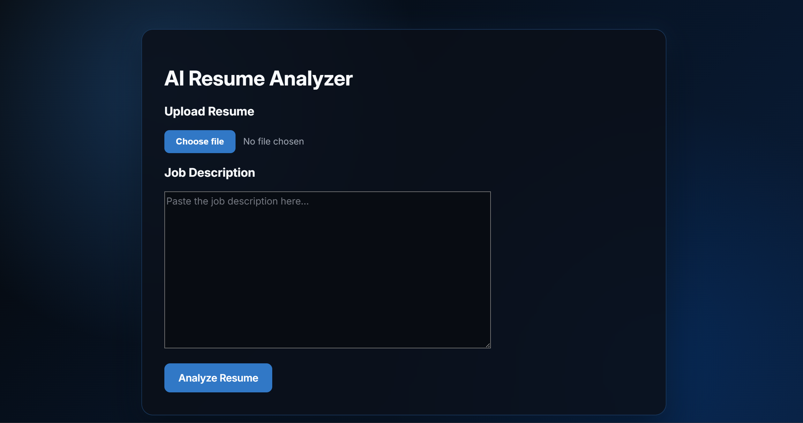
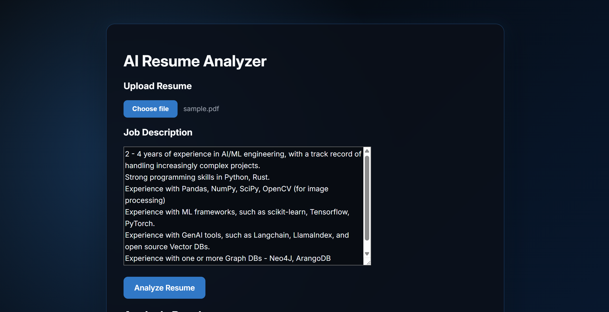
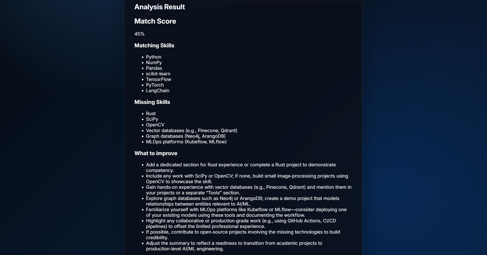

# AI Resume Analyzer

An AI-powered resume analysis application that compares a candidate's resume with a job description and provides structured feedback, including a match score, matching skills, missing skills, and improvement suggestions.

The application uses Reactfor the frontend, FastAPI for the backend, and an LLM through the Groq API for resume analysis.

-----
## ScreenShots

## Home Page
 

## Uploading Resume and Job Description


## Analysis


------
## Features

* Upload resumes in PDF format
* Extract text automatically from uploaded resumes
* Compare a resume against a job description
* Generate an AI-based match score
* Identify matching skills
* Highlight missing skills
* Provide actionable resume improvement suggestions
* Display structured analysis through a React interface

## Tech Stack

Frontend

* React
* JavaScript
* Vite

Backend

* Python
* FastAPI
* Pydantic

AI

* Groq API
* LLM-based resume analysis

Document Processing

* PyPDF

 

## Architecture

```text
┌──────────────────────┐
│      React UI        │
│                      │
│  Resume PDF          │
│  Job Description     │
└──────────┬───────────┘
           │
           │ multipart/form-data
           ▼
┌──────────────────────┐
│       FastAPI        │
│                      │
│  Receive PDF + JD    │
└──────────┬───────────┘
           │
           ▼
┌──────────────────────┐
│       PyPDF          │
│                      │
│ Extract Resume Text  │
└──────────┬───────────┘
           │
           │ Resume + Job Description
           ▼
┌──────────────────────┐
│      Groq LLM        │
│                      │
│   Analyze Resume     │
└──────────┬───────────┘
           │
           │ Structured JSON
           ▼
┌──────────────────────┐
│       FastAPI        │
└──────────┬───────────┘
           │
           │ JSON Response
           ▼
┌──────────────────────┐
│       React UI       │
│                      │
│  Match Score         │
│  Matching Skills     │
│  Missing Skills      │
│  Suggestions         │
└──────────────────────┘
```

## How It Works

1. The user uploads a resume in PDF format.
2. The user provides the job description they want to compare the resume against.
3. React sends the resume and job description to the FastAPI backend using FormData.
4. FastAPI reads the uploaded PDF.
5. PyPDF extracts text from the resume.
6. The extracted resume text and job description are passed to the LLM.
7. The model analyzes the candidate's resume against the job requirements.
8. The backend converts the model output into structured JSON.
9. React displays the analysis to the user.

Example response:

```json
{
  "match_score": 82,
  "matching_skills": [
    "Python",
    "React",
    "FastAPI"
  ],
  "missing_skills": [
    "Docker",
    "Kubernetes"
  ],
  "suggestions": [
    "Add measurable results to project descriptions",
    "Highlight relevant backend development experience"
  ]
}
```

## Project Structure

```text
AI-Resume-Analyzer/
│
├── backend/
│   ├── app.py
│   ├── requirements.txt
│   └── .env  
│
├── frontend/
│   ├── src/
│   │   ├── App.jsx
│   │   ├── App.css
│   │   └── main.jsx
│   │
│   ├── package.json
│   └── vite.config.js
│
├── .gitignore
└── README.md
```

## Getting Started

### 1. Clone the repository

### 2. Set up the backend

Navigate to the backend directory:

```bash
cd backend
```

Create a virtual environment:

```bash
python -m venv venv
```

Activate it on Windows:

```bash
venv\Scripts\activate
```

On macOS/Linux:

```bash
source venv/bin/activate
```

Install dependencies:

```bash
pip install -r requirements.txt
```

### 3. Configure the Groq API

Create a .env file inside the backend directory:

```env
GROQ_API_KEY=your_groq_api_key
```

> Never commit your .env file or API keys to GitHub.

### 4. Start the FastAPI server

```bash
uvicorn app:app --reload
```

The backend will run at:

```text
http://127.0.0.1:8000
```

FastAPI's interactive API documentation is available at:

```text
http://127.0.0.1:8000/docs
```

### 5. Set up the frontend

Open another terminal:

```bash
cd frontend
npm install
npm run dev
```

The React application will typically run at:

```text
http://localhost:5173
```

## Environment Variables

The backend requires:

```env
GROQ_API_KEY=your_groq_api_key
```

Make sure .env is included in .gitignore.

Recommended entries:

```gitignore
# Environment variables
.env

# Python
venv/
__pycache__/
*.pyc

# Node
node_modules/

# Build output
dist/
```

## What I Learned

This project demonstrates several concepts involved in building full-stack AI applications:

* Connecting a React frontend to a Python backend
* Building REST API endpoints with FastAPI
* Uploading files using multipart/form-data
* Extracting text from PDF documents
* Integrating an LLM API into a backend application
* Prompting an LLM to produce structured output
* Working with JSON responses
* Managing API keys using environment variables
* Handling cross-origin requests with CORS
* Rendering AI-generated results dynamically in React

## Future Improvements

* Add drag-and-drop resume upload
* Improve error handling and input validation
* Add loading states while the resume is being analyzed
* Validate structured LLM responses with Pydantic
* Add detailed resume section scoring
* Highlight missing keywords
* Support DOCX resumes
* Add authentication
* Store previous resume analyses
* Add downloadable analysis reports
* Deploy the frontend and backend
* Add automated evaluation and monitoring

